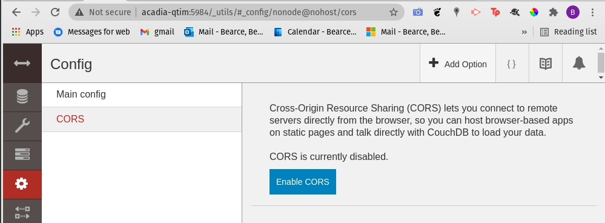
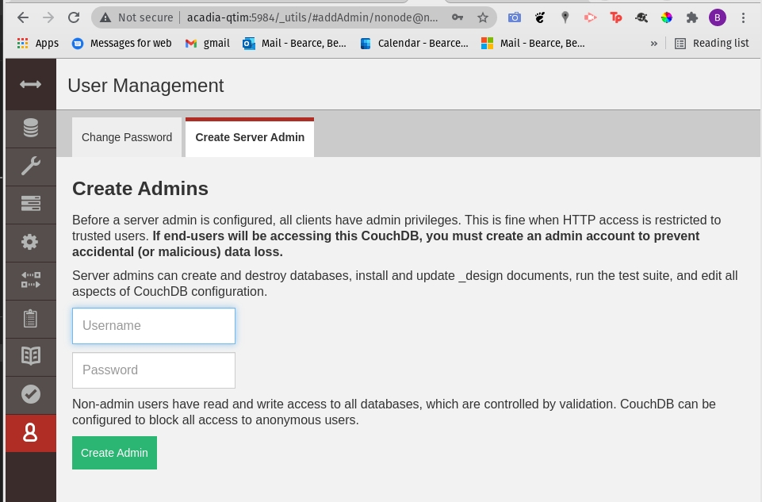

### Deploy couchdb docker image
Decide on a place to store the couchdb data. ```/opt/couchdb/data``` is where a normal couchdb installs will store data so don't use this directory in a docker mount unless you don't have couchdb installed on the machine already.
```
APP_NAME=default
sudo mkdir -p /opt/couchdb/data/$APP_NAME # if it doesn't exist already

# Change in production
COUCHDB_USER=admin
COUCHDB_PASSWORD=password
COUCH_PORT=5984


docker run \
 -p $COUCH_PORT:5984 \
 --name image-comparator-couchdb-$APP_NAME \
 -v /opt/couchdb/data/$APP_NAME:/opt/couchdb/data \
 -d \
 -e COUCHDB_USER=$COUCHDB_USER \
 -e COUCHDB_PASSWORD=$COUCHDB_PASSWORD \
 couchdb:latest
```

> Note you can't make requests to this container wihtout making sure that CORS (cross-origin resource sharing) is enabled:

Once logged into couchdb goto settings to enable CORS:



Create an Admin (if you delete them):


Debugging...

To shell into this container:
```
docker exec -it image-comparator-couchdb bash
```

To stop container (if needed):
```
docker stop image-comparator-couchdb
```

### Set up Image-Comparator in a Docker Container Using Flask

We will be using the *Dockerfile* file in ```Image-Comparator-Dockerfiles```.

#### Build the container

Build a new image for flask and serve in the context of the flask_server folder:
```bash
cd Image-Comparator-Dockerfiles
MACHINE_PORT="8080"

docker build . -f Dockerfile --force-rm -t $CONTAINER_NAME:$CONTAINER_TAG

cd ../

docker run \
  -it \
  --rm \
  --network="host" \
  -p $MACHINE_PORT:8080 \
  -v $PWD/flask_server:/flask_server \
  -v $PWD:$PWD \
  -w /flask_server \
  --name image-comparator-flask-"$APP_NAME" \
  image-comparator:flask
```

#### Run flask server
```bash
flask run --port 8080 --host 0.0.0.0
```

