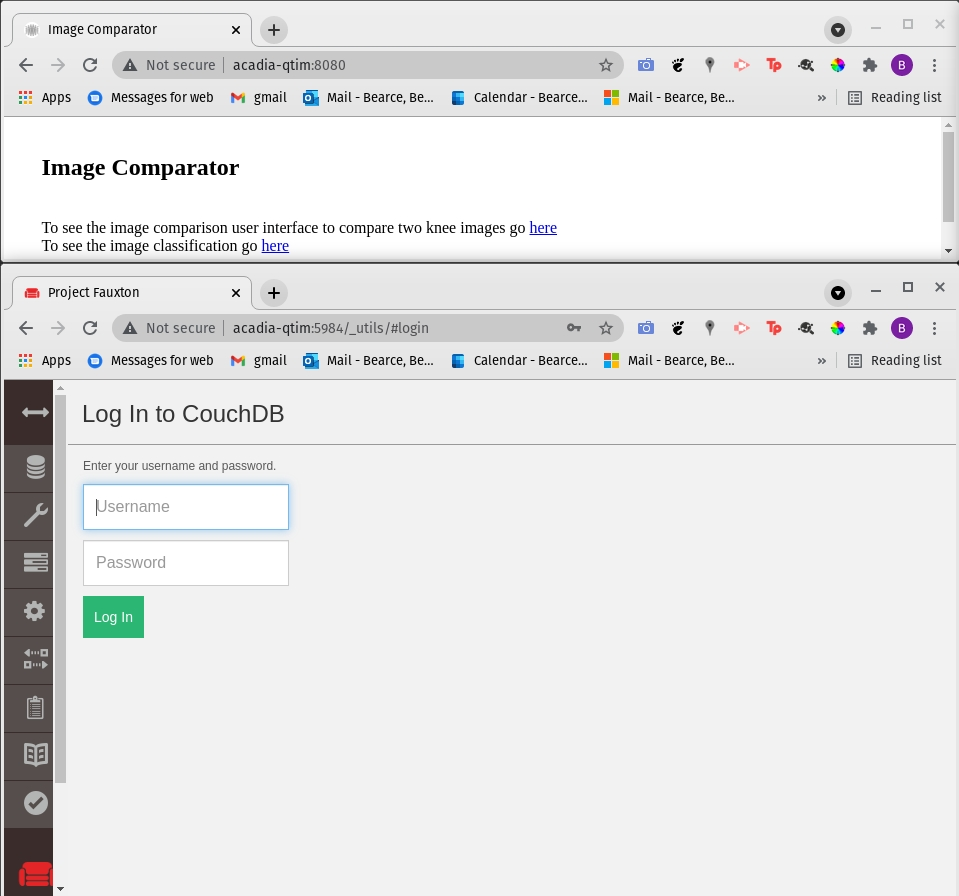

# Image Comparator and Classifier

Purpose: Set up a static webpage and server to host classifier/pairwise comparator tasks for images 

I am not the original author of these files. This repository contains aggregated and updated files from previous developers. See acknowledgements below.


## Instructions for setup

See one of two options:

* [From Dockers](https://github.com/QTIM-Lab/Image-Comparator/tree/master/Image-Comparator-Dockerfiles)
* [From Scratch (harder)](https://github.com/QTIM-Lab/Image-Comparator/tree/master/Image-Comparator-From-Scratch)

Once setup you should have two things running:
* Web Server
* Couchdb instance



Before we continue we need to define some config variables so that all the internal ruby scripts can reference the right things. Find *Image-Comparator/dbutil/Configuration_template.rb*

It should have this:

```ruby
module Configuration
  DNS = 'localhost'
  IMAGES_DB = '<db_name>'
  DB_PORT = '5984'
  HTTP_PORT = '8080'
  DB_ADMIN_USER = '<admin>'
  DB_ADMIN_PASS = '<password>'
end
```

Create a copy called *Configuration.rb* and replace all variables with your custom configurations.

To create and setup the database, run the following:  

```bash
$ curl -X PUT http://admin:<password>@localhost:5984/<db_name>
$ cd /Image-Comparator/dbutil
$ curl -X PUT http://admin:<password>@localhost:5984/<db_name>/_design/basic_views -d @basic_views.json
```

### Image-Comparator

1. Add Images to DB:

We need to add a ruby package *couchrest* to ruby. Run this command:

```bash
$ sudo gem install couchrest
```

Next add images to the database with script *addImagesToDb.rb*:
```bash
$ ruby addImagesToDb.rb <imageFolder> <imageSetName>
```

* \<imageFolder> is any image folder on your machine.  
* \<imageSetName> is the name for the image set.  

2. Add images to an Image Compare List:

```bash
$ makeICLFromImageSetName.rb <image set name> <pct repeat> <list name>
```

* \<image set name> was the name given to addImagesToDb.rb for the <imageSetName>.  
* \<pct repeat> is the percentage of repeated pairs to be displayed.  
* \<list name> is a new Image Compare List name.  

3. Add a task to a user:

```bash
$ makeTask.rb <user> <image-list name> <image-list-type> <task-order>
```

* \<user> is who should complete the task  
* \<image-list name> this is <list name> from above in (makeICLFromImageSetName.rb)  
* \<image-list-type> compare, OCTcompare, classify, classify_nine or quandrant.  
* \<task-order> is what precedence the image compare task takes relative to others assigned to this user.  

4. Change Image-Comparator/ui/two_image.html to have your users in this section:

```html
<!-- manually add users that you assigned tasks too in makeTasks.rb -->
<select id="username" onchange="OnSetUser(this.value)">
  <option selected="selected">Choose your user</option>
  <option value="grader1">Grader 1</option>
  <option value="grader2">Grader 2</option>
  <option value="grader3">Grader 3</option>
  <option value="grader4">Grader 4</option>
</select>
```

### Image-Classifier

Make sure the database you intend to use is already setup.
```bash
$ curl -X PUT http://admin:<password>@localhost:5984/<db_name>
$ cd /Image-Comparator/dbutil
$ curl -X PUT http://admin:<password>@localhost:5984/<db_name>/_design/basic_views -d @basic_views.json
```

* Use addImagesToDb_jkc.rb to add an image set  
* Use makeImageClassifyListImageSet.rb to make an image classify list  
* Use makeTask.rb 


## Acknowledgements

In the order they appear this project has been forked and added to. Yet again we fork to make a QTIM-Lab based project that will be adapted and maintained here.

1. Jayashree Kalpathy-Cramer, PhD for original source code (https://github.com/AlanCramer/Image-Comparator)  
2. Collin Wen (https://github.com/CollinWen/Image-Comparator.git)  
3. Collin Wen (https://github.com/CollinWen/Image-Comparator-Dockerfile)  
4. Jimmy chen (https://github.com/jche253/Fundus_Classifier_Comparator)  


## Contact
For questions, please contact:
* Benjamin Bearce, bbearce@gmail.com  
* Jayashree Kalpathy-Cramer, PhD kalpathy@nmr.mgh.harvard.edu  
